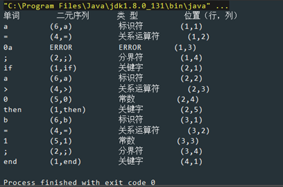

# 编译原理实验

- 词法分析设计
- LL(1)语法分析法

## 实验指导书

`/doc/实验指导书.doc`

## 源码

`/src`
> 参考注释

> 仅供参考

## Demo

### EXAM 1

* case 1

  - 输入

  ```no
  if i=0 then n++;
   a<= 3b %);
  ```

  - 输出

  

* case 2

  - 输入

  ```no
  a=0a;
  if a>0 then
  b=1;
  end
  ```

  - 输出 

  

### EXAM 2

* case 1

  - 输入
  
  ```
  E->TG
  G->+TG|-G
  G->ε
  T->FS
  S->*FS|/FS
  S->ε
  F->(E)
  F->i
  ```

  - 测试代码
  
  ```java
  public class Exam2 {
      public static void main(String[] args) {
          LL1 l = new LL1(new File("src/t2-g.txt"));
  
          l.analysis("i+i*i#");
          l.analysis("(i+(i*i))#");
          l.analysis("i(i*i)#");
      }
  }
  ```

  - 输出
  
  ```
  FIRST(S): [ε, *, /]
  FIRST(T): [(, i]
  FIRST(E): [(, i]
  FIRST(F): [(, i]
  FIRST(G): [ε, +, -]
  
  FOLLOW(S): [#, ), +, -]
  FOLLOW(T): [#, ), +, -]
  FOLLOW(E): [#, )]
  FOLLOW(F): [#, ), *, +, -, /]
  FOLLOW(G): [#, )]
  
  预测分析表：
      #           ε           (           )           i           *           +           |           -           /           
  S	S->ε        null        null        S->ε        null        S->*FS      S->ε        null        S->ε        S->/FS      
  T	null        null        T->FS       null        T->FS       null        null        null        null        null        
  E	null        null        E->TG       null        E->TG       null        null        null        null        null        
  F	null        null        F->(E)      null        F->i        null        null        null        null        null        
  G	G->ε        null        null        G->ε        null        null        G->+TG      null        G->-G       null 
  
  步骤      分析栈               剩余输入串           所用产生式           动作        
  0         #E                  i+i*i#                                  初始化                 
  1         #GT                 i+i*i#              E->TG               POP,PUSH(GT)        
  2         #GSF                i+i*i#              T->FS               POP,PUSH(SF)        
  3         #GSi                i+i*i#              F->i                POP,PUSH(i)         
  4         #GS                 +i*i#                                   GETNEXT(I)          
  5         #G                  +i*i#               S->ε                POP                 
  6         #GT+                +i*i#               G->+TG              POP,PUSH(GT+)       
  7         #GT                 i*i#                                    GETNEXT(I)          
  8         #GSF                i*i#                T->FS               POP,PUSH(SF)        
  9         #GSi                i*i#                F->i                POP,PUSH(i)         
  10        #GS                 *i#                                     GETNEXT(I)          
  11        #GSF*               *i#                 S->*FS              POP,PUSH(SF*)       
  12        #GSF                i#                                      GETNEXT(I)          
  13        #GSi                i#                  F->i                POP,PUSH(i)         
  14        #GS                 #                                       GETNEXT(I)          
  15        #G                  #                   S->ε                POP                 
  16        #                   #                   G->ε                POP                 
  解析成功
  
  步骤      分析栈               剩余输入串           所用产生式           动作        
  0         #E                  (i+(i*i))#                              初始化                 
  1         #GT                 (i+(i*i))#          E->TG               POP,PUSH(GT)        
  2         #GSF                (i+(i*i))#          T->FS               POP,PUSH(SF)        
  3         #GS)E(              (i+(i*i))#          F->(E)              POP,PUSH()E()       
  4         #GS)E               i+(i*i))#                               GETNEXT(I)          
  5         #GS)GT              i+(i*i))#           E->TG               POP,PUSH(GT)        
  6         #GS)GSF             i+(i*i))#           T->FS               POP,PUSH(SF)        
  7         #GS)GSi             i+(i*i))#           F->i                POP,PUSH(i)         
  8         #GS)GS              +(i*i))#                                GETNEXT(I)          
  9         #GS)G               +(i*i))#            S->ε                POP                 
  10        #GS)GT+             +(i*i))#            G->+TG              POP,PUSH(GT+)       
  11        #GS)GT              (i*i))#                                 GETNEXT(I)          
  12        #GS)GSF             (i*i))#             T->FS               POP,PUSH(SF)        
  13        #GS)GS)E(           (i*i))#             F->(E)              POP,PUSH()E()       
  14        #GS)GS)E            i*i))#                                  GETNEXT(I)          
  15        #GS)GS)GT           i*i))#              E->TG               POP,PUSH(GT)        
  16        #GS)GS)GSF          i*i))#              T->FS               POP,PUSH(SF)        
  17        #GS)GS)GSi          i*i))#              F->i                POP,PUSH(i)         
  18        #GS)GS)GS           *i))#                                   GETNEXT(I)          
  19        #GS)GS)GSF*         *i))#               S->*FS              POP,PUSH(SF*)       
  20        #GS)GS)GSF          i))#                                    GETNEXT(I)          
  21        #GS)GS)GSi          i))#                F->i                POP,PUSH(i)         
  22        #GS)GS)GS           ))#                                     GETNEXT(I)          
  23        #GS)GS)G            ))#                 S->ε                POP                 
  24        #GS)GS)             ))#                 G->ε                POP                 
  25        #GS)GS              )#                                      GETNEXT(I)          
  26        #GS)G               )#                  S->ε                POP                 
  27        #GS)                )#                  G->ε                POP                 
  28        #GS                 #                                       GETNEXT(I)          
  29        #G                  #                   S->ε                POP                 
  30        #                   #                   G->ε                POP                 
  解析成功
  
  步骤      分析栈               剩余输入串           所用产生式           动作        
  0         #E                  i(i*i)#                                 初始化                 
  1         #GT                 i(i*i)#             E->TG               POP,PUSH(GT)        
  2         #GSF                i(i*i)#             T->FS               POP,PUSH(SF)        
  3         #GSi                i(i*i)#             F->i                POP,PUSH(i)         
  4         #GS                 (i*i)#                                  GETNEXT(I)          
  失败
  
  ```

* case 2(无测试分析)

  - 输入
  
  ```g
  E->TE'
  E'->+TE'|ε
  T->FT'
  T'->*FT'|ε
  F->(E)|i
  ```

  - 测试代码
  
  ```java
  public class Exam2 {
      public static void main(String[] args) {
          LL1 l2=new LL1(new File("src/t2-2.txt"));
          l2.analysis("i+(i+i*i)#");
      }
  }

  ```
  
  - 输出
  
  ```
  FIRST(E'): [ε, +]
  FIRST(T'): [ε, *]
  FIRST(T): [(, i]
  FIRST(E): [(, i]
  FIRST(F): [(, i]
  
  FOLLOW(E'): [#, )]
  FOLLOW(T'): [#, ), +]
  FOLLOW(T): [#, ), +]
  FOLLOW(E): [#, )]
  FOLLOW(F): [#, ), *, +]
  预测分析表：
  	#           ε           '           (           )           i           *           +           |           
  E'	E'->ε       null        null        null        E'->ε       null        null        E'->+TE'    null        
  T'	T'->ε       null        null        null        T'->ε       null        T'->*FT'    T'->ε       null        
  T	null        null        null        T->FT'      null        T->FT'      null        null        null        
  E	null        null        null        E->TE'      null        E->TE'      null        null        null        
  F	null        null        null        F->(E)      null        F->i        null        null        null        
  
  步骤      分析栈               剩余输入串           所用产生式           动作        
  0         #E                  i+(i+i*i)#                              初始化                 
  1         #E'T                i+(i+i*i)#          E->TE'              POP,PUSH(E'T)       
  2         #E'T'F              i+(i+i*i)#          T->FT'              POP,PUSH(T'F)       
  3         #E'T'i              i+(i+i*i)#          F->i                POP,PUSH(i)         
  4         #E'T'               +(i+i*i)#                               GETNEXT(I)          
  5         #E'                 +(i+i*i)#           T'->ε               POP                 
  6         #E'T+               +(i+i*i)#           E'->+TE'            POP,PUSH(E'T+)      
  7         #E'T                (i+i*i)#                                GETNEXT(I)          
  8         #E'T'F              (i+i*i)#            T->FT'              POP,PUSH(T'F)       
  9         #E'T')E(            (i+i*i)#            F->(E)              POP,PUSH()E()       
  10        #E'T')E             i+i*i)#                                 GETNEXT(I)          
  11        #E'T')E'T           i+i*i)#             E->TE'              POP,PUSH(E'T)       
  12        #E'T')E'T'F         i+i*i)#             T->FT'              POP,PUSH(T'F)       
  13        #E'T')E'T'i         i+i*i)#             F->i                POP,PUSH(i)         
  14        #E'T')E'T'          +i*i)#                                  GETNEXT(I)          
  15        #E'T')E'            +i*i)#              T'->ε               POP                 
  16        #E'T')E'T+          +i*i)#              E'->+TE'            POP,PUSH(E'T+)      
  17        #E'T')E'T           i*i)#                                   GETNEXT(I)          
  18        #E'T')E'T'F         i*i)#               T->FT'              POP,PUSH(T'F)       
  19        #E'T')E'T'i         i*i)#               F->i                POP,PUSH(i)         
  20        #E'T')E'T'          *i)#                                    GETNEXT(I)          
  21        #E'T')E'T'F*        *i)#                T'->*FT'            POP,PUSH(T'F*)      
  22        #E'T')E'T'F         i)#                                     GETNEXT(I)          
  23        #E'T')E'T'i         i)#                 F->i                POP,PUSH(i)         
  24        #E'T')E'T'          )#                                      GETNEXT(I)          
  25        #E'T')E'            )#                  T'->ε               POP                 
  26        #E'T')              )#                  E'->ε               POP                 
  27        #E'T'               #                                       GETNEXT(I)          
  28        #E'                 #                   T'->ε               POP                 
  29        #                   #                   E'->ε               POP                 
  解析成功
  ```

## 说明

- 实验二非终结符支持分析`E'` of `E->TE'` 
- 写的匆忙，有待验证，若有疏漏，还望指出